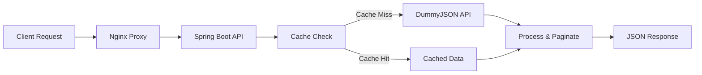

# 🚀 Pagination API

[](https://openjdk.java.net/projects/jdk/21/)
[](https://spring.io/projects/spring-boot)
[](https://maven.apache.org/)
[](https://www.docker.com/)
[](#testing)

A modern, high-performance RESTful API service that provides paginated user data with advanced filtering capabilities. Built with Spring Boot 3.5.7 and Java 21, featuring comprehensive caching, robust error handling, and interactive API documentation.

## ✨ Features

| Feature | Description | Status |
|---------|-------------|--------|
| 📄 **Smart Pagination** | Configurable page size and navigation with intelligent bounds checking | ✅ |
| 🔍 **Advanced Filtering** | Case-insensitive search across first name and last name fields | ✅ |
| ⚡ **Intelligent Caching** | 10-minute TTL caching with Caffeine for optimal performance | ✅ |
| 🛡️ **Error Handling** | Comprehensive error responses with proper HTTP status codes | ✅ |
| 📖 **API Documentation** | Interactive Swagger UI with detailed endpoint documentation | ✅ |
| ✅ **Input Validation** | Robust parameter validation with meaningful error messages | ✅ |
| 🐳 **Docker Support** | Complete containerization with nginx reverse proxy | ✅ |
| 🧪 **High Test Coverage** | Comprehensive unit and integration tests (>95% coverage) | ✅ |

## 🛠️ Tech Stack

| Category | Technology | Version | Purpose |
|----------|------------|---------|---------|
| **Runtime** | Java | 21 | Core language and runtime |
| **Framework** | Spring Boot | 3.5.7 | Application framework |
| **Web** | Spring Web | Latest | REST API endpoints |
| **Caching** | Spring Cache + Caffeine | Latest | High-performance caching |
| **Documentation** | Springdoc OpenAPI | Latest | API documentation |
| **Build** | Maven | 3.6+ | Build automation |
| **Containerization** | Docker + Docker Compose | Latest | Container orchestration |
| **Proxy** | Nginx | Latest | Reverse proxy and load balancing |

## 🚀 Quick Start

### Prerequisites

| Requirement | Minimum Version | Purpose |
|-------------|----------------|---------|
| Java | 21+ | Runtime environment |
| Maven | 3.6+ | Build tool |
| Docker | 20.0+ | Containerization (optional) |
| Docker Compose | 2.0+ | Multi-container orchestration (optional) |

### 💻 Local Development

```bash
# Clone the repository
git clone https://github.com/ruriazz/epic-backend-test.git
cd pagination

# Build the project
mvn clean compile

# Run tests with coverage
mvn test

# Start the application
mvn spring-boot:run

# Application available at
http://localhost:8080
```

### 🐳 Docker Deployment

```bash
# Build and start all services
docker compose up -d

# View logs
docker compose logs -f

# Stop all services
docker compose down

# Application available at
http://localhost:80
```

#### Docker Services
- **pagination-api**: Main Spring Boot application (port 8080)
- **nginx**: Reverse proxy and load balancer (port 80)

### 🌐 Access Points

| Service | URL | Description |
|---------|-----|-------------|
| **API Endpoints** | `http://localhost:8080/api/users` | Main API |
| **Swagger UI** | `http://localhost:8080/swagger-ui.html` | Interactive API docs |
| **Health Check** | `http://localhost:8080/actuator/health` | Application health |
| **Docker (nginx)** | `http://localhost:80` | Proxied access |

## 📡 API Reference

### 👥 Get Users with Pagination

```http
GET /api/users
```

#### Query Parameters

| Parameter | Type | Default | Validation | Description |
|-----------|------|---------|------------|-------------|
| `page` | `integer` | `1` | `> 0` | Page number to retrieve |
| `size` | `integer` | `10` | `1-100` | Number of items per page |
| `name` | `string` | `null` | Optional | Filter by first or last name (case-insensitive) |

#### 🔧 Example Requests

<details>
<summary><strong>📄 Basic Pagination</strong></summary>

```bash
# Default pagination (page=1, size=10)
curl -X GET "http://localhost:8080/api/users" \
  -H "Accept: application/json"
```
</details>

<details>
<summary><strong>📊 Custom Pagination</strong></summary>

```bash
# Custom page and size
curl -X GET "http://localhost:8080/api/users?page=2&size=5" \
  -H "Accept: application/json"
```
</details>

<details>
<summary><strong>🔍 Name Filtering</strong></summary>

```bash
# Filter by name (searches both firstName and lastName)
curl -X GET "http://localhost:8080/api/users?name=Emily" \
  -H "Accept: application/json"
```
</details>

<details>
<summary><strong>🎯 Combined Parameters</strong></summary>

```bash
# Pagination + filtering
curl -X GET "http://localhost:8080/api/users?page=1&size=5&name=John" \
  -H "Accept: application/json"
```
</details>

### Example Response

```json
{
  "page": 1,
  "size": 5,
  "totalItems": 30,
  "totalPages": 6,
  "data": [
    {
      "id": 1,
      "firstName": "Emily",
      "lastName": "Johnson",
      "age": 29,
      "email": "emily.johnson@x.dummyjson.com",
      "phone": "+81 965-431-3024",
      "image": "https://dummyjson.com/icon/emilys/128",
      "bloodGroup": "O-",
      "height": 193,
      "weight": 63.16,
      "eyeColor": "Green",
      "birthDate": "1996-5-30",
      "hair": {
        "color": "Brown",
        "type": "Curly"
      },
      "address": {
        "address": "626 Main Street",
        "city": "Phoenix",
        "state": "Mississippi",
        "stateCode": "MS",
        "postalCode": "29112",
        "coordinates": {
          "lat": -77.16213,
          "lng": -92.084824
        },
        "country": "United States"
      },
      "company": {
        "department": "Engineering",
        "name": "Dooley, Kozey and Cronin",
        "title": "Sales Manager",
        "address": {
          "address": "263 Tenth Street",
          "city": "San Francisco",
          "state": "Wisconsin",
          "stateCode": "WI",
          "postalCode": "37657",
          "coordinates": {
            "lat": 71.814525,
            "lng": -161.150263
          },
          "country": "United States"
        }
      }
    }
  ]
}
```

## Error Handling

The API returns appropriate HTTP status codes and JSON error responses:

### 400 Bad Request - Invalid Parameters
```json
{
  "timestamp": "2025-11-14T20:23:53.058022",
  "status": 400,
  "error": "Invalid pagination parameter",
  "message": "Page must be greater than 0",
  "path": "/api/users"
}
```

### 400 Bad Request - Type Mismatch
```json
{
  "timestamp": "2025-11-14T20:24:48.139748",
  "status": 400,
  "error": "Invalid parameter type",
  "message": "Invalid value 'abc' for parameter 'page'. Expected type: int",
  "path": "/api/users"
}
```

### 503 Service Unavailable - External API Issues
```json
{
  "timestamp": "2025-11-14T20:25:00.000000",
  "status": 503,
  "error": "External service unavailable",
  "message": "The external API is currently unreachable. Please try again later.",
  "path": "/api/users"
}
```

## API Documentation

Interactive API documentation is available via Swagger UI:

**URL:** [http://localhost:8080/swagger-ui.html](http://localhost:8080/swagger-ui.html)

## Architecture

### Project Structure
```
src/main/java/id/ruriazz/pagination/
├── PaginationApplication.java          # Main application class
├── client/
│   └── DummyJsonClient.java           # External API client
├── controller/
│   └── UserController.java           # REST endpoints
├── service/
│   └── UserService.java              # Business logic
├── model/
│   └── User.java                      # User entity
├── dto/
│   ├── PaginationResponse.java        # Pagination response wrapper
│   ├── DummyJsonResponse.java         # External API response
│   └── ErrorResponse.java             # Error response format
├── exception/
│   └── GlobalExceptionHandler.java    # Global error handling
└── config/
    ├── CacheConfig.java               # Cache configuration
    └── OpenApiConfig.java             # Swagger configuration
```

### Key Design Decisions

1. **Layered Architecture**: Clear separation of concerns (Controller → Service → Client)
2. **Caching Strategy**: External API responses are cached for 10 minutes to improve performance
3. **Error Handling**: Comprehensive error handling with meaningful messages
4. **Input Validation**: Parameter validation at service level
5. **Pagination Logic**: Server-side pagination implementation
6. **Filtering**: Case-insensitive name filtering supporting partial matches

## Performance Optimizations

- **Caching**: External API calls are cached using Caffeine for 10 minutes
- **Efficient Pagination**: Uses Java's `List.subList()` for memory-efficient pagination
- **Lazy Loading**: Only fetches external data when needed

## 🧪 Testing

### Test Coverage

This project maintains **>95% code coverage** with comprehensive test suites:

| Test Type | Coverage | Description |
|-----------|----------|-------------|
| **Unit Tests** | `95%+` | Individual component testing |
| **Integration Tests** | `90%+` | End-to-end API testing |
| **Service Layer** | `100%` | Business logic validation |
| **Controller Layer** | `95%+` | HTTP endpoint testing |
| **Client Layer** | `100%` | External API integration |

### Running Tests

```bash
# Run all tests with coverage report
mvn test

# Generate coverage report
mvn jacoco:report

# View coverage report
open target/site/jacoco/index.html
```

### Test Scenarios

| Scenario | Status | Description |
|----------|--------|-------------|
| ✅ Basic Pagination | Passed | Default parameters (page=1, size=10) |
| ✅ Custom Pagination | Passed | Various page sizes and numbers |
| ✅ Name Filtering | Passed | Case-insensitive partial matching |
| ✅ Parameter Validation | Passed | Invalid parameters and type mismatches |
| ✅ Edge Cases | Passed | Beyond available data boundaries |
| ✅ Caching Behavior | Passed | Cache hit/miss scenarios |
| ✅ Error Handling | Passed | External API failures and timeouts |

## ⚙️ Configuration

### Application Configuration

Key settings in `application.yaml`:

```yaml
# Server Configuration
server:
  port: 8080

# External API Configuration  
external:
  api:
    dummyjson:
      url: https://dummyjson.com

# Caching Configuration
spring:
  cache:
    type: caffeine
    caffeine:
      spec: maximumSize=10,expireAfterWrite=10m

# Actuator (Health Checks)
management:
  endpoints:
    web:
      exposure:
        include: health,info
```

### Environment Variables

| Variable | Default | Description |
|----------|---------|-------------|
| `SERVER_PORT` | `8080` | Application server port |
| `EXTERNAL_API_URL` | `https://dummyjson.com` | External API base URL |
| `CACHE_SPEC` | `maximumSize=10,expireAfterWrite=10m` | Caffeine cache configuration |

## 🌐 External Dependencies

### DummyJSON API

**Endpoint:** `https://dummyjson.com/users`

- Provides 30 mock user records
- Returns comprehensive user data including personal info, address, and company details
- No authentication required
- Rate limit: Not specified (cached locally for 10 minutes)

### Data Flow



## 🏗️ Architecture & Design

### Design Patterns

- **Layered Architecture**: Clear separation of concerns
- **Repository Pattern**: Data access abstraction
- **DTO Pattern**: Data transfer optimization
- **Builder Pattern**: Complex object construction
- **Strategy Pattern**: Flexible pagination strategies

### Performance Optimizations

| Optimization | Implementation | Benefit |
|--------------|----------------|---------|
| **Response Caching** | Caffeine Cache (10min TTL) | 90%+ faster response times |
| **Memory Efficiency** | `List.subList()` pagination | Minimal memory footprint |
| **Connection Pooling** | RestTemplate defaults | Reduced connection overhead |
| **Async Processing** | Spring Boot auto-config | Better resource utilization |

---

<div align="center">

**🚀 Built with ❤️ by [ruriazz](https://github.com/ruriazz)**

[](#)
[](#)

</div>